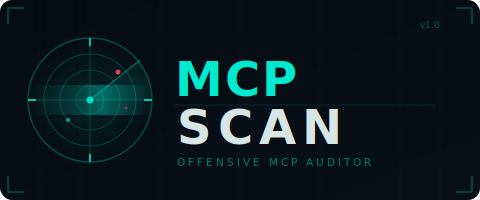

<p align="center">
  
</p>

<p align="center">
  <b>The first dedicated offensive security auditor for MCP servers</b>
</p>

<p align="center">
  <a href="https://github.com/sahiloj/MCPScan/actions"></a>
  <a href="https://github.com/sahiloj/MCPScan/releases/latest"></a>
  <a href="LICENSE"></a>
</p>

<p align="center">
  <a href="#-threat-landscape">Threat Landscape</a> ·
  <a href="#-checks">Checks</a> ·
  <a href="#-install">Install</a> ·
  <a href="#-usage">Usage</a> ·
  <a href="#-cve-references">CVEs</a> ·
  <a href="#-output-formats">Output</a>
</p>

---

```
  MCPScan — Offensive MCP Server Auditor
  ──────────────────────────────────────────────────────────

  Server: filesystem-server  (stdio: npx @modelcontextprotocol/server-filesystem /home)
  Enumerated: 12 tools · 0 resources · 0 prompts

   CRITICAL   MCP-701  RCE Vector: Shell/Execution Parameter Name
              Location:  tool: bash_exec > inputSchema
              Evidence:  Dangerous params: command, args
              CVE:       CVE-2025-6514 (CVSS 9.6)
              Fix:       Use allowlists; never pass raw input to shell functions

   HIGH       MCP-304  Overprivileged: Unrestricted Filesystem Path Parameter
              Location:  tool: write_file > inputSchema
              Evidence:  Tool: write_file, capabilities: fs-write
              Fix:       Add a path allow-list restricting access to approved directories

   HIGH       MCP-202  Credential Leak: Anthropic API Key
              Location:  tool: call_llm > description
              Evidence:  sk-ant-api03-••••••••••••••••
              Fix:       Rotate immediately. Never embed secrets in tool metadata.

  ╭──────────────── MCPScan Results ─────────────────╮
  │                                                   │
  │   Scanned 3 servers  ·  Enumerated in 4.2s        │
  │   2 critical  ·  5 high  ·  1 medium  ·  1 low    │
  │                                                   │
  ╰───────────────────────────────────────────────────╯
```

---

## 🔥 Threat Landscape

MCP has become the standard for connecting AI agents to the real world — and attackers got there first. Researchers have already documented:

| Threat | Impact | Scale |
|---|---|---|
| **Tool Poisoning** | Hidden instructions hijack LLM behavior | >72% attack success rate |
| **RCE via mcp-remote** | Full OS command execution | ~500,000 developers affected |
| **Exposed Servers** | Unauthenticated access to tools and data | 492+ servers found publicly |
| **Credential Leakage** | API keys embedded in tool metadata | Thousands of installations |
| **Supply Chain** | Compromised npm packages spawning malicious MCP modules | Active in the wild |

No dedicated offensive scanner existed. **MCPScan fills that gap.**

---

## 🔍 Checks

MCPScan runs **8 check categories** covering the full MCP attack surface:

| ID | Category | What It Finds |
|---|---|---|
| MCP-1xx | `tool-poisoning` | Hidden Unicode (zero-width, RTL override), HTML/XML injection, prompt injection keywords, base64 payloads, overlong descriptions, markdown exfiltration |
| MCP-2xx | `credential-leak` | AWS keys, API tokens (Anthropic, OpenAI, GitHub, Stripe, Slack), JWTs, private keys, DB connection strings |
| MCP-3xx | `overprivileged` | Shell+filesystem combos, shell+network combos, unrestricted path params, code eval, sensitive path access (`~/.ssh`, `~/.aws`) |
| MCP-4xx | `auth-missing` | Unauthenticated server enumeration, CORS wildcard, `0.0.0.0` binding, missing security headers |
| MCP-5xx | `session-hijack` | Session IDs in URL params, predictable/time-based IDs, missing `Secure`/`HttpOnly` cookie flags |
| MCP-6xx | `ssrf` | User-supplied URL parameters, webhook/callback endpoints, HTTP resource URI templates with variables |
| MCP-7xx | `rce-vectors` | `command`/`exec`/`eval` parameter names, execution language in descriptions, sanitization claim detection |
| MCP-8xx | `supply-chain` | CVE version ranges, missing lockfiles, typosquatted MCP package names |

### 📋 CVE References

| CVE | Package | CVSS | Summary |
|---|---|---|---|
| [CVE-2025-6514](https://jfrog.com/blog/2025-6514-critical-mcp-remote-rce-vulnerability/) | `mcp-remote` | **9.6** 🔴 | Arbitrary OS command execution — first full system compromise via MCP |
| [CVE-2025-49596](https://nvd.nist.gov/vuln/detail/CVE-2025-49596) | `@modelcontextprotocol/inspector` | **9.4** 🔴 | Unauthenticated RCE via inspector-proxy |
| [CVE-2025-59536](https://research.checkpoint.com) | `@anthropic-ai/claude-code` | **9.1** 🔴 | Project file RCE + API token exfiltration |
| [CVE-2025-53967](https://nvd.nist.gov/vuln/detail/CVE-2025-53967) | `figma-developer-mcp` | **8.2** 🟠 | Command injection via shell string interpolation |
| [CVE-2026-25536](https://nvd.nist.gov/vuln/detail/CVE-2026-25536) | `@modelcontextprotocol/sdk` | **7.5** 🟡 | StreamableHTTP data leakage across clients (v1.10.0–1.25.3) |

---

## ⚡ Install

**Requires Node.js ≥ 18**

```bash
git clone https://github.com/sahiloj/MCPScan.git
cd MCPScan
npm install
npm run build
```

Link globally and run from anywhere:

```bash
npm link
mcpscan --help
```

---

## 🚀 Usage

### Scan a stdio server

```bash
mcpscan scan --command "npx" --args "-y @modelcontextprotocol/server-filesystem /home/user"
```

### Scan from your AI client config

```bash
# Claude Desktop (macOS)
mcpscan scan --config ~/Library/Application\ Support/Claude/claude_desktop_config.json

# Auto-discover all known config locations (Claude, Cursor, etc.)
mcpscan scan --all-configs
```

### Scan a remote HTTP / SSE server

```bash
mcpscan scan --target http://localhost:3000/mcp
```

### Sweep localhost for exposed MCP servers

```bash
mcpscan scan --all-configs --network
```

### Run targeted checks only

```bash
mcpscan scan --all-configs --checks tool-poisoning,credential-leak,rce-vectors
```

### Severity filtering

```bash
# Only report high and critical
mcpscan scan --all-configs --severity high
```

### CI/CD integration

```bash
# Exit code 2 = critical findings, exit code 1 = high findings
mcpscan scan --all-configs --severity high --output sarif > findings.sarif
```

### Discover without scanning

```bash
mcpscan discover --all-configs --network
mcpscan discover --all-configs --output json
```

---

## ⚙️ All Options

```
mcpscan scan [options]

  -c, --config <path>    Path to claude_desktop_config.json or .mcp.json
  -t, --target <url>     Direct HTTP/SSE MCP server URL
  --command <cmd>        Spawn and scan a stdio server
  --args <args>          Space-separated args for --command
  --all-configs          Auto-discover all known MCP config locations
  --network              Also probe localhost ports for exposed HTTP servers
  --checks <list>        Comma-separated checks to run (default: all)
  -o, --output <format>  terminal | json | sarif  (default: terminal)
  --severity <level>     critical | high | medium | low | info  (default: info)
  --timeout <ms>         Per-server connection timeout  (default: 30000)
  --verbose              Show check errors and debug output
```

**Config locations searched by `--all-configs`:**

| Platform | Path |
|---|---|
| macOS | `~/Library/Application Support/Claude/claude_desktop_config.json` |
| Linux | `~/.config/claude/claude_desktop_config.json` |
| Windows | `%APPDATA%\Claude\claude_desktop_config.json` |
| Any | `.mcp.json` · `.cursor/mcp.json` · `~/.config/mcp/config.json` |

---

## 📊 Output Formats

### Terminal *(default)*

Severity-colored findings with CVE references and a summary box. Built for humans.

### JSON

Machine-readable report for SIEMs, custom dashboards, and automation:

```json
{
  "tool": "mcpscan",
  "version": "0.1.0",
  "timestamp": "2026-03-10T12:00:00.000Z",
  "summary": {
    "serversScanned": 3,
    "totalFindings": 8,
    "findingsBySeverity": { "critical": 2, "high": 4, "medium": 1, "low": 1, "info": 0 }
  },
  "results": [...]
}
```

### SARIF 2.1.0

Drop directly into **GitHub Code Scanning**, VS Code SARIF Viewer, or any SARIF-aware security platform. Each finding maps to a rule with `security-severity` CVSS scores.

---

## 🏗️ Architecture

```
src/
├── cli.ts                    Entry point — commander argument parsing
├── scanner.ts                Orchestrator: enumerate → checks → deduplicate → report
├── types.ts                  Shared interfaces (Finding, ScanResult, CheckFn …)
├── discovery/
│   ├── config-reader.ts      Parses all known MCP config formats (Zod-validated)
│   └── network-scan.ts       Probes localhost ports for exposed HTTP servers
├── transport/
│   ├── stdio-client.ts       StdioClientTransport + timeout + process cleanup
│   └── http-client.ts        StreamableHTTP with SSE fallback; captures response headers
├── checks/
│   ├── tool-poisoning.ts     MCP-1xx — Unicode, injection, base64, exfil
│   ├── credential-leak.ts    MCP-2xx — 16 credential patterns with FP suppression
│   ├── overprivileged.ts     MCP-3xx — Dangerous capability combinations
│   ├── auth-missing.ts       MCP-4xx — Unauthenticated access, CORS, 0.0.0.0
│   ├── session-hijack.ts     MCP-5xx — Session ID exposure and predictability
│   ├── ssrf.ts               MCP-6xx — User-controlled URL parameters
│   ├── rce-vectors.ts        MCP-7xx — Shell execution patterns
│   └── supply-chain.ts       MCP-8xx — CVE ranges, lockfiles, typosquats
└── report/
    ├── terminal.ts           Chalk + Boxen rich terminal output
    └── json.ts               JSON and SARIF 2.1.0 serialization
```

Each check exports `async function check(data: ServerData): Promise<Finding[]>`. All checks run in parallel via `Promise.allSettled` — a broken check never blocks the rest.

---

## 🛡️ Finding Schema

```typescript
interface Finding {
  id: string;           // "MCP-701"
  title: string;        // "RCE Vector: Shell/Execution Parameter Name"
  severity: "critical" | "high" | "medium" | "low" | "info";
  category: string;     // "rce-vectors"
  description: string;  // Full explanation of the risk
  evidence: string;     // The exact value that triggered the finding
  location: string;     // "tool: bash_exec > inputSchema.properties.command"
  cve?: string;         // "CVE-2025-6514"
  cvss?: number;        // 9.6
  remediation: string;  // Actionable fix guidance
}
```

---

## 🔧 Development

```bash
# Type-check without building
npm run typecheck

# Run directly without building (uses tsx)
npm run dev -- scan --all-configs

# Full rebuild
npm run build
```

---

## 📚 References

- [MCP Specification (2025-11-25)](https://modelcontextprotocol.io/specification/2025-11-25)
- [OWASP MCP Top 10 (2025)](https://owasp.org/www-project-mcp-top-10/2025/)
- [Tool Poisoning Attacks — Invariant Labs](https://invariantlabs.ai/blog/mcp-security-notification-tool-poisoning-attacks)
- [MCP Attack Vectors — Palo Alto Unit 42](https://unit42.paloaltonetworks.com/model-context-protocol-attack-vectors/)
- [CVE-2025-6514 Deep Dive — JFrog](https://jfrog.com/blog/2025-6514-critical-mcp-remote-rce-vulnerability/)
- [MCP Security Best Practices](https://modelcontextprotocol.io/specification/draft/basic/security_best_practices)
- [Network-Exposed MCP Servers — Trend Micro](https://www.trendmicro.com/vinfo/us/security/news/cybercrime-and-digital-threats/mcp-security-network-exposed-servers-are-backdoors-to-your-private-data)

---

<p align="center">
  Released under the <a href="LICENSE">MIT License</a> · Built for the security community
</p>
